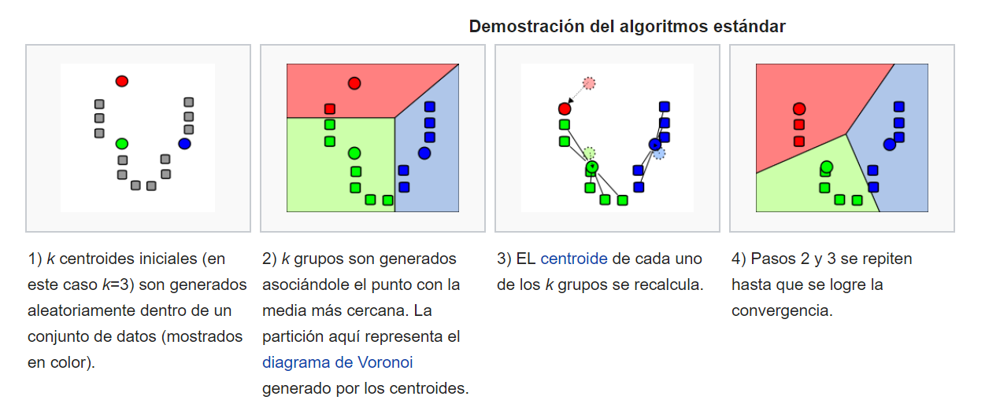

# Teoría K-Means

 K-Means es muy fácil de inteprestar. Muy utilizado.

Consiste en definir agrupaciones de modo que se minimice la variación total dentro de la agrupación.

Esa variación total se calcula usando el algoritmo de Hartigan-Wong. 

> la suma de las distancias al cuadrado de las distancias euclidianas entre los elementos y el centroide correspondiente.

El centroide es la media de los puntos. 

! [algoritmo](https://i.stack.imgur.com/r7WYA.png)

Intento minimizar las distancias de los cuatro grupo (total within-cluster variation)



Pero claro, para minimizar eso podría hacer 100 cluster si tengo 100 muestras. 

### Algoritmo




# Ejercicio K-means Clustering.

El objetivo es crear un modelo que permita agrupar por estado (Estados Unidos) de acuerdo a las características de delincuencia. Para esto use los datos de USArrests de la librería datasets.

Las tareas a desarrollar son las siguientes:

1. Verifique si el dataset contiene NA’s.
2. Para clustering, es recomendable realizar una acción previa antes de ajustar el modelo, ¿qué debe realizar? (Hint: ¿es lógico comparar los valores caballos de potencia con edad?)
3. Genere la matriz de distancias, para esto use la función get_dist o dist y grafíquela con fviz_dist.
4. Realice un k-means de 2 centros con un total de 10 inicializaciones.
5. Con la función fviz_cluster genere un gráfico para visualizar los datos y usando la librería ggplot2 realice un plot de las variables Murder vs. UrbanPop identificando cada cluster.
6. Entrene diferentes k_means cambiando el número de centros y usando la función grid.arrange realice un plot de todos los clusters en un solo gráfico. Analice los resultados.
7. Use la función map_dbl para aplicar la función que tiene en el código que calcula los wss del k-means y pruebe con diferentes centros. Realice el mejor plot que le permita visualizar los resultados para poder aplicar el método.
8. Realice el mismo procedimiento de la pregunta 7 para aplicar silhoutte method.
9. Utilice la función  para el método gap statistics y analice los resultados identificando número óptimo de clusters.
10. Ajuste su k-means final.
11. Tarea: cree una función para evaluar nuevas observaciones.

