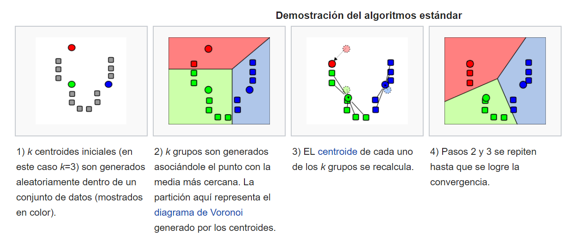

# Teoría K-Means

 K-Means es muy fácil de inteprestar. Muy utilizado.

Consiste en definir agrupaciones de modo que se minimice la variación total dentro de la agrupación.

Esa variación total se calcula usando el algoritmo de Hartigan-Wong. 

> la suma de las distancias al cuadrado de las distancias euclidianas entre los elementos y el centroide correspondiente.

El centroide es la media de los puntos. 

Intento minimizar las distancias de los cuatro grupo (total within-cluster variation)

Pero claro, para minimizar eso podría hacer 100 cluster si tengo 100 muestras. 

### Algoritmo

## ¿Cómo determinar el número de clusters?

### Elbow Method

El total within-cluster sum of square (wss) cuantifica qué tan compacto es el clustering y queremos hacerlo tan pequeño como sea possible. Por tanto Podemos seguir el siguiente algoritmo para definir el número óptimo de clusters:

* Calcula el algoritmo de clustering (por ejemplo, k-means clustering) para diferentes valores de k.
* Para cada k, calcula el total within-cluster sum of square (wss)
* Realiza un plot de la curva wss respect al número de clusters k.
* La ubicación de una pequeña curva (un codo, elbow) en el plot, es generalmente considerada como un indcador apropiado del número de clusters.

### Average Silhouette Method

* En resumen, el average silhouette method se enfoca en medir la calidad de un clustering. Esto es, determina qué tan bien se encuentra cada objeto dentro de su grupo.
* Un gran average silhouette indica un buen clustering
* El average silhouette method calcula la silueta promedio de observaciones para diferentes valores de k.
* El número óptimo de clusters k es el que maximiza el average silhouette sobre un rango de posibles valores.
* Se define silhouette como:

https://en.wikipedia.org/wiki/Silhouette_(clustering)

### Gap Statistic Method

* El Gap Statistic Method ha sido publicado por R. Tibshirani, G. Walther y T. Hastie (Standford University, 2001). Podría aplicarse a otros métodos de clustering.
* Involucra simulaciones de Monte Carlo.
* Realiza Bootstraping para generar B copias del dataset de referencia.
* Es el más fundamentado matemáticamente.

# Ejercicio K-means Clustering.

El objetivo es crear un modelo que permita agrupar por estado (Estados Unidos) de acuerdo a las características de delincuencia. Para esto use los datos de USArrests de la librería datasets.

Las tareas a desarrollar son las siguientes:

1. Verifique si el dataset contiene NA’s.
2. Para clustering, es recomendable realizar una acción previa antes de ajustar el modelo, ¿qué debe realizar? (Hint: ¿es lógico comparar los valores caballos de potencia con edad?)
3. Genere la matriz de distancias, para esto use la función get_dist o dist y grafíquela con fviz_dist.
4. Realice un k-means de 2 centros con un total de 10 inicializaciones.
5. Con la función fviz_cluster genere un gráfico para visualizar los datos y usando la librería ggplot2 realice un plot de las variables Murder vs. UrbanPop identificando cada cluster.
6. Entrene diferentes k_means cambiando el número de centros y usando la función grid.arrange realice un plot de todos los clusters en un solo gráfico. Analice los resultados.
7. Use la función map_dbl para aplicar la función que tiene en el código que calcula los wss del k-means y pruebe con diferentes centros. Realice el mejor plot que le permita visualizar los resultados para poder aplicar el método.
8. Realice el mismo procedimiento de la pregunta 7 para aplicar silhoutte method.
9. Utilice la función  para el método gap statistics y analice los resultados identificando número óptimo de clusters.
10. Ajuste su k-means final.
11. Tarea: cree una función para evaluar nuevas observaciones.

