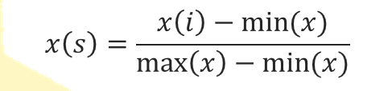
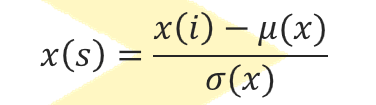

# Aprendizaje no supervisado

En unsupervised learning no tenemos variable respuesta.

Necesitamos agrupar registros que se parecen entre sí, aunque no me vaya a decir qué son realmente. 

## Tipos
**Clustering**

* K-means.
* Hierarchical Clustering.
* Probabilistic Clustering.

**Data Compression**

* Principal Component Analysis.
* Singular Value Decomposition (u otras factorizaciones de matrices).
* t-Distributed Stochastic Neighbor Embedding. 

**Unsupervised Deep Learning**

* Autoencoders.
* Anomaly detection.


##Conceptos 

### Métrica (o distancia)

Para agrupar, necesitamos definir distancias. Importantísimo en aprendizaje supervisado. 

Una métrica 𝑑:𝑋×𝑋→ (0,Infinito)  es una función que satisface las siguientes condiciones para cada 𝑥, 𝑦∈𝑋:

*𝑑 𝑥,𝑦 ≥0, no negativa.

*𝑑 𝑥,𝑦 =0⟺𝑥=𝑦, identidad indecirnible.

*𝑑 𝑥,𝑦 =𝑑 𝑦,𝑥 , simetría.

* 𝑑 𝑥,𝑧 ≤𝑑 𝑥,𝑦 + 𝑑 𝑦,𝑧 , desigualdad triangular.

Tipos:

* Distancia euclideana.
* Distancia de Minkowski.
* Distancia de Manhattan.
* Distancia de Levenshtein.
* Distancia del infimo y supremo.

### Scaling

Tenemos un dataset con dos variables.

- Pesos: que va de 0 a 120. 
- Número de hijo: que va de 0 a 10. 

Si yo eso lo represento en un plano X,Y, me salen que un tío que tiene 60 k y 0 hijos se parece mucho a otro que pesa 60 y tiene 10, Hay que normalizar eso, para que todas las variables estén entre 0 y 1. 

**Métodos de normalización**

Existen varias formas de normalizar los valores de las variables. Uno es la estandarización de la escala completa de todos los valores de las variables, es decir, que  𝑥 𝑖 ∈ 0,1 , conocida como min-max normalization, y se obtiene aplicando la siguiente transformación:

 

También puede usarse la que seguramente muchos conocen:

 

### N/A

Como tenemos que calcular distancias, qué hacemos con valores queno tienen valor para una variable. 

Lo mejor es asignarle la **moda**, no la **media**


## ¿Cómo determinar el número de clusters?

El total within-cluster sum of square (wss) cuantifica qué tan compacto es el clustering y queremos hacerlo tan pequeño como sea possible. Por tanto Podemos seguir el siguiente algoritmo para definir el número óptimo de clusters:

* Calcula el algoritmo de clustering (por ejemplo, k-means clustering) para diferentes valores de k.
* Para cada k, calcula el total within-cluster sum of square (wss)
* Realiza un plot de la curva wss respect al número de clusters k.
* La ubicación de una pequeña curva (un codo, elbow) en el plot, es generalmente considerada como un indcador apropiado del número de clusters.




## Hierarchical Clustering

Un poco más difícil de entender. Henry nunca lo ha usado para datos reales

## Dimensionaliadades altas, como enfrentarnos a ellas. 

Por ejemplo, 


Como normalmente 



