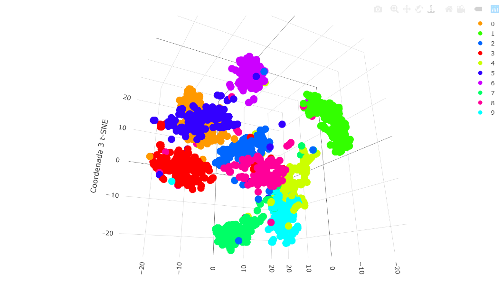

# t-distributed Stochastic Neighbor Embedding

* Recordemos que no es un algoritmo de clustering, sino de reducción de dimensionalidad. 
* Mucho más complicado pero mucho más potente que PCA. 
* Usa gradient-descent para reducir de muchas dimensions a 2 o 3. No más. 
* Detecta relacionoes no lineales a diferencia de PCA. Por tanto, por ejemplo, para imágenes nos viene perfecto, porque es absurdo asumir linealidad. 
* Esas dos dimensiones son creadas por él, no son las originales. Tengo un dataset completamente distinto. Es exploratoio.
* Al igual que el PCA, es una técnica de proyección, o reducción de dimensión, que se aplica con la intención de visualizar N variables en 2.
* Uno de los resultados de t-SNE es una matriz de dos dimensiones (puede ser de tres también), donde cada observación (fila) representa un dato de entrada. Luego podemos aplicar un clustering y agrupar los casos según su distancia en este nuevo mapa de 2 dimensiones. 
* t-SNE mapea los datos multidimensionales a un espacio dimensional inferior.
* Después de este proceso, las variables de entrada ya no son identificables, y no puede hacerse ninguna inferencia basada únicamente en la salida del t-SNE. Por lo tanto, es principalmente una técnica de exploración y visualización de datos.
* Desventaja sobre PCA:

  Si llega una nueva observación, tendría que expresarla en la nueva base y no tengo forma de hacerlo porque t-SNE no me da la fórmula de ese cambio de base. Tendría que introducirlo en el dataset y hacer de nuevo el algoritmo. En PCA, si llega una nueva observación, no tenemos ese problema porque sí tenemos los autovalors que me permiten hacer el cambio de base. 

Comparación entre PCA y t-SNE (2D):

Vista del ejercicio para algoritmo en 3D

A fondo: https://lvdmaaten.github.io/
Más ligero: https://towardsdatascience.com/visualising-high-dimensional-datasets-using-pca-and-t-sne-in-python-8ef87e7915b

## Ejercicio

Ejercicio PCA.

El objetivo crear un algoritmo supervisado que usando imágenes de números escritos a mano les coloque una etiqueta:
1.	Lea el dataset zip.train de la carpeta data_in y seleccione solamente 1/3 de los datos.
2.	Reduzca la dimensionalidad a dos dimensiones usando un t-SNE. 
3.	Hagamos trampa, puesto que nuestro dataset está etiquetado, realice un plot del tsne y añada las etiquetas usando la función text. Analice los resultados.
4.	Repita paso 2) y 3) para tres dimensiones. Analice los resultados.
5.	Tarea: realice un modelo de clustering usando el t-sne.
